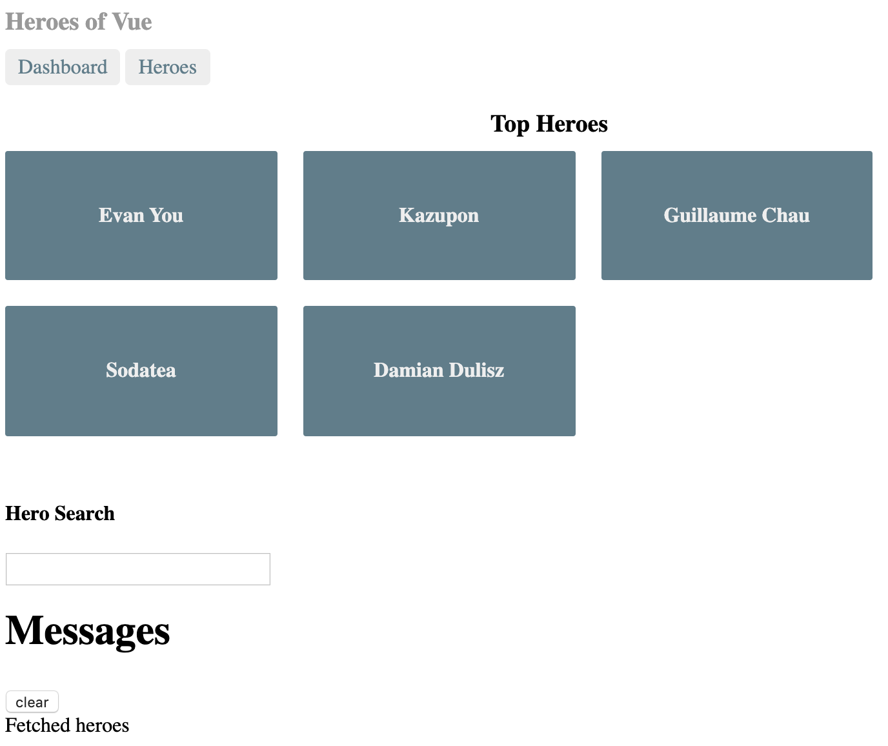
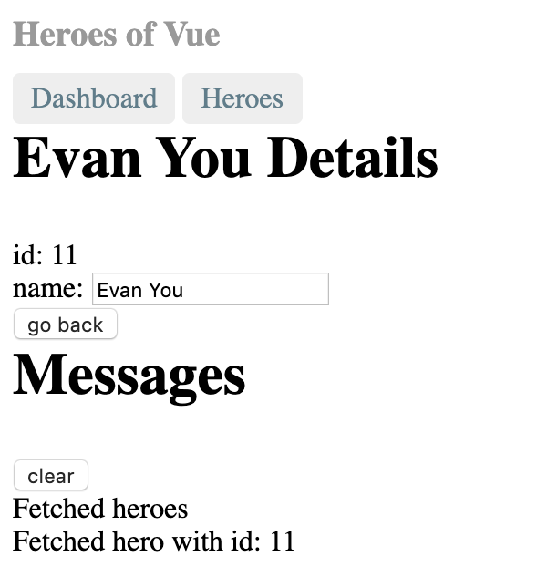
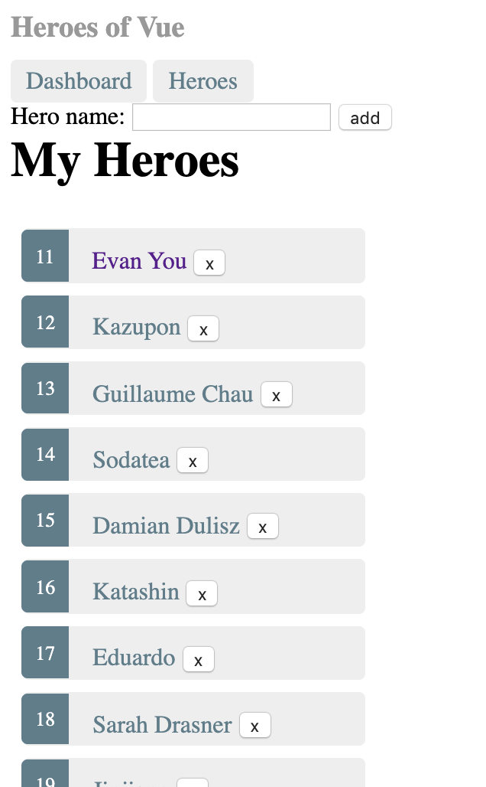

# Tutorial

Inspired by Angular [Tour of Heroes](https://angular.io/tutorial#tutorial-tour-of-heroes) I wanted to make my own twist on it and in the same time give a shout-out to some of the people behind Vue!

So here is the story of the Heroes of Vue!

## The beginning

In this first part we will build the application using just one file!
Crazy you would say. No node_modules black hole :O Just bare with me :)

Full application exist here [demo](https://heroes-of-vue.netlify.com/tutorial-parts/full-app.html).
Want dive into the code? [Here's the repo](https://github.com/lindgr3n/heroes-of-vue)

What we will be learning:

* Using Vue with just one html file
* Creating components
* Computed properties
* Set up routing using Vue-router
* Directives
* Filters to transform data
* Basic api to fetch data
* Two-way data binding

## Final application

Some screens on the final application.

### Screenshot of the dashboard

---

Screenshot of our dashboard showing the top five heroes and the ability to search for heroes. Messages shows the history of actions done in the application.



### A Hero detail view

---

Screenshot of our detail view where we can edit our heroes name.



### List of heroes

---

Screenshot of our heroes list where we can add and remove heroes.



## Chapter one - Setup

Lets start with creating a single html file. Then we do `npm install` you say?
Nope, no need! As I said, we'll use one html file for the full application :)

Now lets create our start file.

```bash
mkdir heroes-of-vue
touch heroes-of-vue/index.html
```

Or for windows

```bash
mkdir heroes-of-vue
echo . > index.html
```

Or just right click create new file :)

Next we create a standard html template and we include Vue using a CDN link.
Starter file is based on [getting started](https://vuejs.org/v2/guide/#Getting-Started)

The Vue guide does an excellent job in explaining how things work.
Open your HTML file your browser of choice. You should see "Hello heroes".

See the result for [part1](https://heroes-of-vue.netlify.com/tutorial-parts/part1.html)

## Chapter two - components

When talking about frontend today you'll have a hard time not reading about components. Components is the frontend lego bricks used to build applications.

So how do we create a component in Vue?

### Creating our first component

Take a quick look at [Component basics](https://vuejs.org/v2/guide/components.html) to get a basic understanding about it.
Then get back and follow along!

Lets make a hero editor component to display information about our heroes!

```js
const HeroDetail = Vue.component('vue-hero-detail', {
  data() {
    return {
      hero: {
        id: 1,
        name: 'Evan You'
      }
    }
  },
  template: `
          <div>
            <h2>{{hero.name}} Details</h2>
            <div><span>id: </span>{{hero.id}}</div>
          </div>`
});
```

Here we register our component using `Vue.component` with the tag name `vue-hero-detail` so we later can use it in our application.

Important to remember that **global registration of components need to be done before the Vue instance is made**.

### Data

The `data` block is where we declare properties used in the component. Find more information in the [documentation for data](https://vuejs.org/v2/guide/instance.html#Data-and-Methods).

In short these properties will become reactive. If a reactive property change it will trigger a re-render.

### Template

The `template` is where we declare how the component should look. Check out [documentation for template](https://vuejs.org/v2/guide/syntax.html) to find more information.

Look at [part2](https://heroes-of-vue.netlify.com/tutorial-parts/part2.html) to see it in action.

### Filters to transform data

How would it look to have the hero name in uppercase? Could do `hero.name.toUpperCase()` in the template or in the `hero.name` property.

But then we get some special logic and no possibility to reuse it. Also what if we don't want our name to be upperCase in some other part of the component?

Instead we can make use of Vue's [Filter system](https://vuejs.org/v2/guide/filters.html).

Here we define an filter on our component.

```js
filters: {
    uppercase: function(value) {
        return value.toUpperCase()
    }
},
```

Then we can update our template to use

```html
<h2>{{hero.name | uppercase}} Details</h2>
```

Look at [part3](https://heroes-of-vue.netlify.com/tutorial-parts/part3.html) to see it in action.

Here we could chain it if we want to use multiple filters together using the `|` (pipe) operator.

```js
message | filterA | filterB
```

We also have the ability to register a global filter so we don't need to set it up on the component level.

```js
Vue.filter('uppercase', function (value) {
  if (!value) return ''
  return value.toUpperCase()
})
```

## Chapter three - Bindings

Just showing the data is a good start. But to show some data we also need a way to add more and edit the current data.

First thing that comes to mind is to add an input box and an event listener on change and save the value for each value entered. This would work just fine. But Vue have an ace up its sleeve. [Two-way data binding!](https://vuejs.org/v2/guide/forms.html)

### Two-way data binding

What is two-way data binding? It's a way to "connect" a data value with for example an input field. To do that we make use of Vue's `v-model`.

Lets add an input element and attach `v-model`

```html
<input v-model="hero.name" placeholder="name"/>
```

Now when we type in our textbox the `hero.name` will automatically update thanks to the `v-model`!

To know the "magic" behind `v-model` we can do the following

```html
<input
  v-bind:value="hero.name"
  v-on:input="hero.name = $event.target.value"
>
```

This is the same thing as v-model does in the background. So just for exercise lets add a second input without v-model.

```html
<input v-model="hero.name" placeholder="name"/>
<input v-bind:value="hero.name" v-on:input="hero.name = $event.target.value" placeholder="name"/>
```

Now you can type in either of the input boxes and the name will update on all tree places! Amazing!

See it in action in [part4](https://heroes-of-vue.netlify.com/tutorial-parts/part4.html)

## Chapter four - Vue magic

One thing that "scares" people that start checking out Vue is the strange element attributes that starts with `v-`.

> Did you notice it in our hero component?

This is nothing to be afraid of and I will try and explain the :fire:power:fire: behind it!

### Vue directives

This syntax quirk `v-` is called [directives](https://vuejs.org/v2/guide/syntax.html#Directives). And they have special meaning in Vue. If you are coming from Angular you know it as `ng-`.

Take a quick look at the Vue [directives documentation](https://vuejs.org/v2/guide/syntax.html#Directives) and get back here. I'll wait :)

So lets take it from the beginning. If we go back to the `Two-way data binding` we used something called `v-model` to bind our value to be reactive. In the extra exercise we used `v-bind` to reactively update the input value.

We will get into this more so don't worry if it feels "strange". For me personally this was a bit strange at first. Now that I've have used it for a while it feels "natural".

### Community of Heroes

Vue has the superhero Evan but in reality Vue is a community of heroes! So lets add some more heroes in [part5](https://heroes-of-vue.netlify.com/tutorial-parts/part5.html)!

First we add a list of heroes that we got from the [Vue team](https://vuejs.org/v2/guide/team.html).

```js
const heroes = [
    { id: 11, name: 'Evan You' },
    { id: 12, name: 'Kazupon' },
    { id: 13, name: 'Guillaume Chau' },
    { id: 14, name: 'Sodatea' },
    { id: 15, name: 'Damian Dulisz' },
    { id: 16, name: 'Katashin' },
    { id: 17, name: 'Eduardo' },
    { id: 18, name: 'Sarah Drasner' },
    { id: 19, name: 'Jinjiang' },
    { id: 20, name: 'Rahul Kadyan' },
    { id: 21, name: 'Pine Wu' },
    { id: 22, name: 'Darek G Wędrychowski' },
    { id: 23, name: 'Michał Sajnóg' },
    { id: 24, name: 'Chris Fritz' },
    { id: 25, name: 'Phan An' },
    { id: 26, name: 'ULIVZ' },
    { id: 27, name: 'Linusborg' },
    { id: 28, name: 'GU Yiling' },
    { id: 29, name: 'Edd Yerburgh' },
    { id: 30, name: 'Pine' }
]
```

Then we can create a new component to show our great heroes!

Lets crate a new component like before named `vue-heroes` that will use our list of heroes.

```js
const Heroes = Vue.component('vue-heroes', {
  data: function () {
    return {
      heroes: heroes
    }
  },
  template: `
    <div>
        <h2>My Heroes</h2>
        <ul class="heroes">
        <div v-for="(hero, index) in heroes" :key="index" >
            <li>
                <span class="badge">{{hero.id}}</span> {{hero.name}}
            </li>
        </div>
        </ul>
    </div>`
});
```

> Hold your horses! Now I see that strange `v-` thing again on my element! `v-for`, `v-model` and `v-bind` What is it? Also I found a typo in `:key="index"`. There should not be a `:` there!

Don't worry all is good. That's how it looks! As pointed out in [directives](#vue-directives) this is one of the core features of Vue.

#### v-for

[v-for](https://vuejs.org/v2/guide/list.html#Mapping-an-Array-to-Elements-with-v-for) is used for looping over elements.

In our heroes component we use it as:

```html
<div v-for="(hero, index) in heroes" :key="index" >
    <li>
        <span class="badge">{{hero.id}}</span> {{hero.name}}
    </li>
</div>
```

Here we use our array of `heroes` and for each hero we will crate a `div` with the content. Because our array consists of objects we can access its properties on the defined variable `hero`.

Are you coming from react-land you would do something like this

```js
return (
  <ul>
    {
      heroes.map((hero, index) =>
        <div key={index}>
          <li>
            <span class="badge">{hero.id}</span> {hero.name}
          </li>
        </div>
      )}
  </ul>
)
```

#### v-model

[v-model](https://vuejs.org/v2/guide/components.html#Using-v-model-on-Components) we have already covered in [Two-way-databinding](#two-way-data-binding)

#### v-bind

[v-bind](https://vuejs.org/v2/guide/syntax.html#Arguments) is a way to reactively update the html attribute when the value change.

In our heroes component you notice it in `:key="index"` here we set the key attribute according to the index value. Would we remove the binding we would render `key="index"`instead of `key="0"`

Here you also have the "typo" ;) It's called a shorthand. We'll get into that in the next chapter.

## Chapter five - Less is more

Typing all this `v-bind`, `v-on` can be tiring. So shorthands to the rescue!

### Shorthands

[shorthand](https://vuejs.org/v2/guide/syntax.html#Shorthands) to save some typing :)

`v-bind:key` is the same as `:key` as explained above. We also have `v-on:click` that works the same as `@click`!

From the Vue documentation

```html
<!-- full syntax -->
<a v-bind:href="url"> ... </a>

<!-- shorthand -->
<a :href="url"> ... </a>

<!-- shorthand with dynamic argument (2.6.0+) -->
<a :[key]="url"> ... </a>
v-on Shorthand
```

```html
<!-- full syntax -->
<a v-on:click="doSomething"> ... </a>

<!-- shorthand -->
<a @click="doSomething"> ... </a>

<!-- shorthand with dynamic argument (2.6.0+) -->
<a @[event]="doSomething"> ... </a>
```

### Modifiers

Another great thing that we can use is something called [modifiers](https://vuejs.org/v2/guide/events.html#Event-Modifiers)

Recognize this? (From the react [docs](https://reactjs.org/docs/handling-events.html))

```js
function ActionLink() {
  function handleClick(e) {
    e.preventDefault();
    console.log('The link was clicked.');
  }

  return (
    <a href="#" onClick={handleClick}>
      Click me
    </a>
  );
}
```

Would we do the same in Vue it would look like this

```js
Vue.createComponent('action-link', {
    template: `
        <a href="#" @click.prevent="handleClick">
            Click me
        </a>
    `,
    methods: {
        handleClick(event) {
            console.log('The link was clicked.');
        },
    },
})
```

Notice we don't need to handle the `event.preventDefault()` inside our method when we use our `.prevent` modifier :+1:

Checkout the [modifiers](https://vuejs.org/v2/guide/events.html#Event-Modifiers) documentation about more modifiers for both events and key modifiers.

## Chapter six - Let the fun begin

Now that we have the ability to edit our hero and show some more heroes. Lets make some styling to it. Before we start to interact with the application.

### Set up basic style

We will use the `<style>` tag in our html header to append styling to our application. See the result in [part5](https://heroes-of-vue.netlify.com/tutorial-parts/part5.html)

Here i will borrow the same style as used in Angular's "Tour of heroes". Think they did a good job!

In the next version where we will be using `Vue-cli` we will introduce [TailwindCSS](https://tailwindcss.com/) a css framework or rather a css utility library to make more of our own style.

### Selection of our heroes

How fun is it to have a list but we cant do anything with it? Lets add the ability to select our heroes in [part6](https://heroes-of-vue.netlify.com/tutorial-parts/part6.html)!

Lets start by adding a click listener on our list using `@click` (Remember from earlier thats the same as `v-on:click`). To know where we are clicking we get use of the style we added in last part.

So here we use a new value `selectedHero` that we set using our method `onSelect` that will add/remove our selected class.

```html
<ul class="heroes">
    <div v-for="(hero, index) in heroes" :key="index" >
        <li @click="onSelect(hero)" :class="{selected: hero.id === selectedHero.id}" >
            <span class="badge">{{hero.id}}</span> {{hero.name}}
        </li>
    </div>
</ul>
```

So what can we do now? Lets update our detail view with the selected component!

### Show hero details

Currently we have a hard coded hero in our details component. To make it dynamic we need to use something called [props](https://vuejs.org/v2/guide/components-props.html). Take a quick look in the documentation!

In short its how we can pass in our selected hero into our detail component to use.

```js
 props: {
    hero: {
        type: Object,
        default: () => { }
    }
},
data() {
    return {

    }
},
```

Doing this you will notice that our uppercase filter will get broken because value will be undefined.  So we can fix this with a minor check.

```js
uppercase: function (value) {
    if (!value) return '';
    return value.toUpperCase()
}
```

So to make use of the selected component we move our detail component inside our heroes component.

```html
<vue-hero-detail :hero="selectedHero"></vue-hero-detail>
<h2>My Heroes</h2>
```

You will also notice when we select a hero and edit its name we get updates in our list!

### Chapter seven - Vue plugins

Angular talks about something called services. In Vue a good way to do something similar would be to use a [Vue plugin](https://vuejs.org/v2/guide/plugins.html).

So lets build something like that in [part7](https://heroes-of-vue.netlify.com/tutorial-parts/part7.html)!

### Message service

The Angular tutorial adds something called message service used to log what is happening in the application. To make something similar in Vue we can make use of the Vue prototype. And include it in our Vue plugin that contains our api requests also :).

Our message service is just list of messages and two methods to add and clear our messages.

```js
const messageService = new Vue({
    data: function () {
        return {
            messages: [],
        }
    },
    methods: {
        add: function (message) {
            this.messages.push(message)
        },
        clear: function () {
            this.messages = [];
        }
    },
})
```

Here we make a new instance of Vue to make use of Vues reactiveness. So when we call our methods our messages will trigger a re-render.

### Vue plugin

To start creating our plugin we start by crating a empty object. The main thing our plugin needs is a install method. So we can install it using `Vue.use`

```js
const HeroesApi = {};
HeroesApi.install = function (Vue, options) {
  console.log('Plugin installed!)
}

Vue.use(HeroesApi)
```

This is our basic plugin. Running this will print 'Plugin installed!' in the console. In [part8](https://heroes-of-vue.netlify.com/tutorial-parts/part8.html) we will add our api and include our messageService.

## Chapter eight - API

Currently we have a global list of heroes. This works but what if we want to get a updated list? Best way would be to have some kind of api to get our heroes at startup.

### Heroes Api

Our api will consist of five different methods. This methods we store in a parameter `api`. By adding this in our plugin we can expose it by adding it to the prototype chain. That is `Vue.prototype.$heroesApi = api;`

```js
HeroesApi.install = function (Vue, options) {
  const api = {
    getHeroes() {
        return heroes;
    },
    getHero(id) {
        return heroes.find(hero => hero.id == id) || {}
    },
    addHero(name) {
        const maxId = heroes.reduce((max, hero) => max > hero.id ? max : hero.id, -1)
        const heroToAdd = hero({ id: maxId + 1, name });
        heroes.push(heroToAdd)
    },
    deleteHero(hero) {
        heroes = heroes.filter(existingHero => existingHero.id != hero.id)
    },
    search(pattern) {
        return heroes.filter(existingHero => existingHero.name.includes(pattern))
    }
  }
  Vue.prototype.$heroesApi = api;
}
```

Now we can test it by running `Vue.prototype.$heroesApi.getHeroes()` and we can see that it returns our heroes list. In [part9](https://heroes-of-vue.netlify.com/tutorial-parts/part9.html) we will include our message service!

### Message service plugin

Now our plugin is almost ready. Last piece is to include the message service. Remember what we did earlier? Now we can include that instance in our plugin and make use of our methods. So our final plugin will look like

```js
HeroesApi.install = function (Vue, options) {
  const messageService = new Vue({
      data: function () {
          return {
              messages: [],
          }
      },
      methods: {
          add: function (message) {
              this.messages.push(message)
          },
          clear: function () {
              this.messages = [];
          }
      },
  })

  Vue.prototype.$messageService = messageService;


  const api = {
      getHeroes() {
          Vue.prototype.$messageService.add('Fetched heroes')
          return heroes;
      },
      getHero(id) {
          Vue.prototype.$messageService.add('Fetched hero with id: ' + id)
          return heroes.find(hero => hero.id == id) || {}
      },
      addHero(name) {
          const maxId = heroes.reduce((max, hero) => max > hero.id ? max : hero.id, -1)
          const heroToAdd = hero({ id: maxId + 1, name });
          Vue.prototype.$messageService.add('Added hero: ' + heroToAdd)
          heroes.push(heroToAdd)
      },
      deleteHero(hero) {
          Vue.prototype.$messageService.add('Deleted hero with id: ' + hero.id)
          heroes = heroes.filter(existingHero => existingHero.id != hero.id)
      },
      search(pattern) {
          Vue.prototype.$messageService.add('Searching heros with: ' + pattern)
          return heroes.filter(existingHero => existingHero.name.includes(pattern))
      }
  }
  Vue.prototype.$heroesApi = api;
}
```

If you notice from the full-app we did not use a plugin! Adding a plugin here was just to show how one could do it :)

## Chapter nine - Binding it all together

Now the plugin we did would not work outside this page because it uses the global heroes list. What if we refactored and included the heroes in our plugin? Then if we wanted we could use this plugin in any Vue application.

### Refactor the heroes list

Take a moment and see if you can manage to do it. Ill just go and get some :coffee: in the meantime :)

Done? Great! If you just continued reading and just wanted the answer, this is how i did it in [part10](https://heroes-of-vue.netlify.com/tutorial-parts/part10.html)

Fist just move the heroes list and hero object inside our plugin.

```js
HeroesApi.install = function (Vue, options) {
  const hero = function ({ id, name }) {
      return {
          id,
          name
      }
  };

  // From https://vuejs.org/v2/guide/team.html
  let heroes = [
      { id: 11, name: 'Evan You' },
      { id: 12, name: 'Kazupon' },
      { id: 13, name: 'Guillaume Chau' },
      { id: 14, name: 'Sodatea' },
      { id: 15, name: 'Damian Dulisz' },
      { id: 16, name: 'Katashin' },
      { id: 17, name: 'Eduardo' },
      { id: 18, name: 'Sarah Drasner' },
      { id: 19, name: 'Jinjiang' },
      { id: 20, name: 'Rahul Kadyan' },
      { id: 21, name: 'Pine Wu' },
      { id: 22, name: 'Darek G Wędrychowski' },
      { id: 23, name: 'Michał Sajnóg' },
      { id: 24, name: 'Chris Fritz' },
      { id: 25, name: 'Phan An' },
      { id: 26, name: 'ULIVZ' },
      { id: 27, name: 'Linusborg' },
      { id: 28, name: 'GU Yiling' },
      { id: 29, name: 'Edd Yerburgh' },
      { id: 30, name: 'Pine' }
  ].map(hero);
// ...
}
```

If you run the application now it will totally break! :fire: That is because our components no longer have access to the heroes variable. :(

To fix this we can use the power of our plugin :)

Remember the name in our plugin for exposing our api? `Vue.prototype.$heroesApi = api;`

### Refactor heroes component

So the thing we can do is to refactor our `<vue-heroes>` component to use our api instead of using the global variable.

```js
data: function () {
    return {
        heroes: [],
        selectedHero: {}
    }
},
mounted: function () {
    this.heroes = this.$heroesApi.getHeroes()
},
```

Now when you reload the application it should work as before! Also we now have a working message service! in [part11](https://heroes-of-vue.netlify.com/tutorial-parts/part11.html) we will create a new component so you can see it in action.

## Chapter ten - Messages

Now with our plugin and message service api we need a way to display its data.

### Message service component

Give it a shot and try and implement your own `vue-message-service` component and include it in our app template.

You will need to:

* Get the list from our plugin
* Loop over the messages and show the content.
* (bonus) add a button to clear the messages

Brb getting some more :coffee:!

So did you manage? :)

Here is how i did my implementation

```js
Vue.component('vue-message-service', {
    computed: {
        messageService() {
            return this.$messageService
        }
    },
    template: `
            <div v-if="messageService.messages.length">
                <h2>Messages</h2>
                <button class="clear" @click="messageService.clear()">clear</button>
                <div v-for='message in messageService.messages'> {{message}} </div>
            </div>`
})
```

Currently you will only see one message because we are only trigging the fetch inside our `vue-heroes`component. If you would like to try you can open the developer tools in the browser and type `Vue.prototype.$heroesApi.getHeroes()` in the console.

Notice the `vue-message-service` component should update its list.

## Chapter eleven - Time to move

Currently we have everything rendering in our app template. But what if we added a dashboard? We would start to get a lot of information in the same place.

We would like the dashboard and list of heroes be rendered by themself and the when clicking a hero its detail view will open. Here we can use [vue-router](https://router.vuejs.org/) Lets set up our routes in [part12](https://heroes-of-vue.netlify.com/tutorial-parts/part12.html)

### Routing

First we need to include vue router in the `head`.

```html
<script src="https://unpkg.com/vue-router/dist/vue-router.js"></script>
```

Lets start by creating our routes

```js
const routes = [
  { path: '/dashboard', component: Dashboard },
  { path: '/heroes', component: Heroes },
  { path: '/hero/:id', component: HeroDetail }
]
```

Here we define that calling `http://locahost/dashboard` will render Dashboard component. `/heroes` our Heroes component.

Next we create our router

```js
const router = new VueRouter({
    routes // short for `routes: routes`
})
```

Last we inject our router to the Vue instance.

```js
var app = new Vue({
    router,
    el: '#app',
    data: {
        hello: 'Hello heroes!'
    }
});
```

### Dashboard component

Last thing we need to create is the Dashboard component where we show the top 5 heroes.

```js
const Dashboard = Vue.component('vue-dashboard', {
    data() {
        return {
            heroes: []
        }
    },
    mounted: function () {
        this.heroes = api.getHeroes().slice(0, 5)

    },
    template: `
            <div style="display: flex; flex-direction: column;" >
                <h3>Top Heroes</h3>
                <div class="grid grid-pad">
                <div v-for="(hero, index) in heroes" class="col-1-4" :key="index" >
                    <div class="module hero">
                    <h4>{{hero.name}}</h4>
                    </div>
                </div>
                </div>
            </div>`
});
```

To show it we add it to our main template.

```html
<div id="app" class="p-8">
      <h1 class="text-blue-500 text-3xl">{{ hello }}</h1>
      <vue-dashboard></vue-dashboard>
      <vue-message-service></vue-message-service>
      <vue-heroes></vue-heroes>
  </div>
```

Well that did not look pretty. Let add some style for it.

Now we have a router but it don't really do anything yet. This we will fix in [part13](https://heroes-of-vue.netlify.com/tutorial-parts/part13.html)

## Chapter twelve - Change our view

To make use of the power vue-router gives we need to use a element called `<router-view>` This will render the component our routes point at. So calling `http://localhost:3000/dashboard` will make the `<router-view>` render our `Dashboard` component.

### Router-view

So lets update our app template by including our `<router-view>` And also add links to be able to switch between the dashboard and our heroes list.

```html
<div id="app" class="p-8">
    <h1>{{title}}</h1>
    <nav>
        <router-link to="/dashboard">Dashboard</router-link>
        <router-link to="/heroes">Heroes</router-link>
    </nav>
    <router-view></router-view>
    <vue-message-service></vue-message-service>
</div>
```

Running the application now we can move between our two components :)
To make it look a bit better we add some more style for our links.

Getting close to the final-app!

Things we are missing is:

* Adding more heroes
* Searching heroes

Lets get going on that in [part14](https://heroes-of-vue.netlify.com/tutorial-parts/part14.html)

## Chapter thirteen - Increase the community

So now we can display and edit heroes. Lets add the ability to add more heroes!

### Creating heroes

Lets add a input above our heros list to add more heroes.

```html
<div>
    <label>Hero name:
        <input v-model="heroToAdd" />
    </label>
    <!-- (click) passes input value to add() and then clears the input -->
    <button @click="addHero(heroToAdd)">
        add
    </button>
</div>
```

To make this work we make use of a v-model on our input to store the hero name. Then we add a method `addHero` that will add the new hero to our list.

Lets add one more thing while we are on our heroes list. Removing heroes from the list.

### Removing heroes

Could happen that we make a type when we add a hero so we should be able to remove items from the list we add a button on our list items.

```html
<button class="delete" title="delete hero" @click.prevent="deleteHero(hero)">x</button>
```

and we need to add the method `deleteHero` that will call our api to remove the selected hero.

Starting to look good! In [part15](https://heroes-of-vue.netlify.com/tutorial-parts/part15.html) we will add the ability to search for heroes.

## Chapter fourteen - Finding the one

Lets add the ability to search for specific heroes.

### Hero search

First thing to do is to update our api to handle search.

```js
search(pattern) {
    Vue.prototype.$messageService.add('Searching heros with: ' + pattern)
    return heroes.filter(existingHero => existingHero.name.includes(pattern))
}
```

This is a very basic search functionality but it works :)

Next we create a search component. Start with the base.

```js
Vue.component('vue-hero-search', {
    data() {
        return {
            search: '',
            heroes: []
        }
    },
    methods: {},
    template: ``
})
```

Next our template

```html
<div id="search-component">
    <h4>Hero Search</h4>

    <input id="search-box" v-model="search" @input="fetchHeros" />

    <ul class="search-result">
        <li v-for="hero in heroes" :key="hero.id" >
            <router-link :to="'/hero/'+hero.id">
            {{hero.name}}
            </router-link>
        </li>
    </ul>
</div>
```

And last we add the search method

```js
fetchHeros() {
    if (!this.search) {
        this.heroes = [];
    } else {
        this.heroes = this.$heroesApi.search(this.search)
    }
}
```

Then we can add our search component in our dashboard.

```html
<div style="display: flex; flex-direction: column;" >
    <h3>Top Heroes</h3>
    <div class="grid grid-pad">
        <div v-for="(hero, index) in heroes" class="col-1-4" :key="index" >
            <div class="module hero">
              <h4>{{hero.name}}</h4>
            </div>
        </div>
    </div>
    <vue-hero-search></vue-hero-search>
</div>
```

Try typing into the search box, It will automatically update the list of matching heroes!

Remember we create a `vue-hero-detail` component in the beginning? Currently we have setup up a route to it when calling `/hero/:id`. The `:id` here is the id of the hero. So calling `http://localhost:3000/hero/11` would return `Evan You`.

But that wont work yet... That is something we will fix in [part16](https://heroes-of-vue.netlify.com/tutorial-parts/part16.html) of the tutorial!

## Chapter sixteen - A way back

Currently we don't have any way to link between routes. Here we can make use of Vue routers `<router-link>` component to move between routes.

### Route links component

The important part of `router-link` is the `to` attribute. It says what route we want to go to when clicking the link.

```html
<nav>
    <router-link to="/dashboard">Dashboard</router-link>
    <router-link to="/heroes">Heroes</router-link>
</nav>
```

So where would it be nice to have a router-link?

* When selecting a hero in heroes list
* Dashboard heroes
* Search results

So lets fix that!

Starting with our `<vue-heroes-search>`

```html
<router-link v-for="(hero, index) in heroes" :key="index" :to="'/hero/'+hero.id" >
    <li @click="onSelect(hero)" :class="{selected: hero.id === selectedHero.id}" >
        <span class="badge">{{hero.id}}</span> {{hero.name}}
        <button class="delete" title="delete hero" @click.prevent="deleteHero(hero)">x</button>
    </li>
</router-link>
```

Lets try if it works!

```bash
[Vue warn]: Error in render: "TypeError: Cannot read property 'name' of undefined"
found in

---> <VueHeroDetail>
```

Ops, what happened there? Did we enter something wrong? Lets check the component it references to in the error message. Our `HeroDetail` and how we use the prop name.

> How do we send a prop when using a router-link?

Here we can see that we are sending in our hero as prop. Now you wonder, how do we send a prop when using a router-link? Good question!

Here we have two ways to manage to get the hero when mounting our `vue-hero-detail`.

### Using route params

We could get the params from the url when our component mount. But then we need to move or hero prop to our data. Or we could make a local variable that gets its value from prop or from mounter.

```js
data() {
  return {
    hero: {}
  }
},
mounted: function () {
  this.hero = api.getHero(this.$route.params.id)
},
```

That works! But now we have made our detail component stuck to be needed to get its hero id from route params! Best would be if we could still pass the hero id in as prop to make it more self contained. Lets see how we could do that in [part17](https://heroes-of-vue.netlify.com/tutorial-parts/part17.html)

### Using route props

The approach we can take is the one described in [Passing Props to Route Components](https://router.vuejs.org/guide/essentials/passing-props.html#passing-props-to-route-components)

To make this work we refactor our props to take a id.

```js
props: {
    id: {
        type: String,
        default: ''
    }
}
```

Then we can update our mount to use the passed id instead.

```js
mounted: function () {
    this.hero = this.$heroesApi.getHero(this.id)
}
```

Now refresh and it should still work! And now we have the ability to reuse the component as ordinary component `<vue-hero-detail id="11" ></vue-hero-detail>`

Now we can fix the last two components `<vue-dashboard>` and `<vue-hero-search>`.

```html
<router-link v-for="(hero, index) in heroes" class="col-1-4" :key="index" :to="'hero/'+hero.id" >
    <div class="module hero">
    <h4>{{hero.name}}</h4>
    </div>
</router-link>
```

```html
<router-link :to="'/hero/'+hero.id">
    {{hero.name}}
</router-link>
```

Now try and update a heroes name and you will see it updates in the dashboard, heroes list, search list and detail header!

## Chapter seventeen - The end

Lets check our goals we set at the beginning. Have we manage to cover all the pieces?

* [x] Using Vue using just one html file
* [x] Creating components
* [x] Computed properties
* [x] Set up routing using Vue-router
* [x] Directives
* [x] Filters to transform data
* [x] Basic api to fetch data
* [x] Two-way data binding

I hope you feel like you have learned something and also that you can check all the boxes :)

Thats all for now. In the next tutorial we are going to rebuild this application using `vue-cli`! Where we will focus more on component separation and testing!

I hope to see you there! until next time. Happy coding! "Build small, build a lot!"
